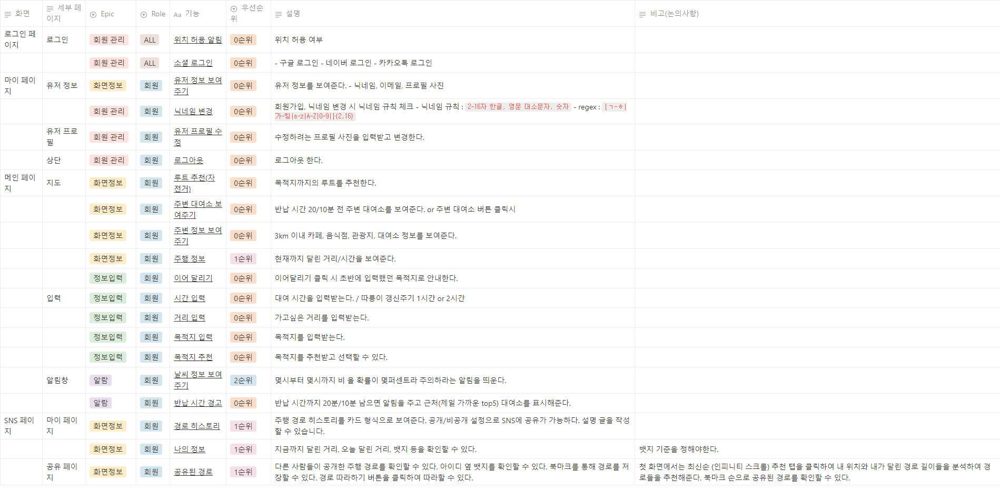
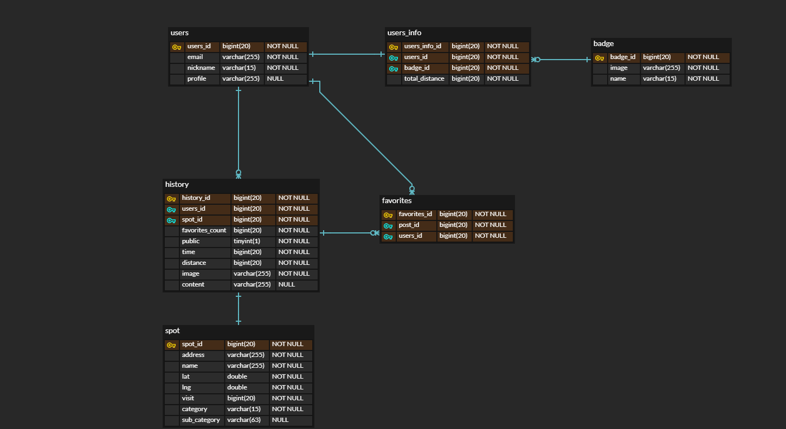

# 따라와

## 아이디어 회의
- 외국인을 위한 국내 알짜배기 여행 애플리케이션
    - 기본 기능
        1. 구글 리뷰를 기반으로 인기 장소, 맛집 등 유명 장소 추천
        2. 관광 데이터랩을 활용하여 주요 관광지 추천
    - 추가 기능
        1. 한국이 자주 사용하는 유명한 어플 추천
- 스마트 영양사
    - 기본 기능
    1. 일주일 치 식단 추천
        1. 레시피 제공
                
- 카페 구분 후 추천
- 선물 추천

- 회식자리 추천
    - 모임 만들기 → 지역 설정 or 지역 투표(도 할까) → 돼지고기, 소고기, 등 투표 기능 → 투표 완료 시 가게 투표
    - 가게 좋아요, 싫어요 기능 → 나중에 모임 만들기 했을 때, n명이 이 가게를 좋아합니다/싫어합니다 같은 거 띄움(작게 색있는 숫자로 표시하는 것이 좋을듯)
    - 먹지 못하는 음식, 먹기 싫은 음식 설정 → n명이 먹지 못하는 음식이 있습니다/n명이 먹기 싫어하는 음식입니다 같은거 띄움(작게 색있는 숫자로 표시하는 것이 좋을듯)
        - 가게 메뉴 데이터를 크롤링 이외 얻을 수 있는 방법 모색 必
- 드라마에 나온 패션 분석 및 비슷한 옷 추천
    - 이미지 캡셔닝 기술 접목
- 따라와(따릉이)
    - 따릉이 대여소 근처 관광지, 맛집, 여행지, 카페 등 추천
    - 대여소에서 1, 2시간 거리 대여소까지 길 안내(경유지 입력 가능)
        - 예시1 : 원하는 위치 대여소 클릭(출발지) → 1시간 거리 내에 있는 대여소 표시 → 카페 태그를 클릭하고 원하는 카페 클릭하여 경유지 추가(반납 안하는 경우) → 자전거를 타고 카페까지 30분 걸린다면, 주변 30분 내로 갈 수 있는 대여소 표시 → 반납을 원하는 경우 대여소 클릭하여 경유지 추가 ….. (반복)
        - 예시2 : 출발지랑 목적지를 입력하면 가는 길을 표시해주고 남은 시간(처음에 시간 입력 받음)이 10분 이하가 되면 주변 대여소 위치를 표시해준다. 버튼을 클릭하여 주변 대여소 위치를 확인할 수 있다. 주변 대여소 위치를 클릭하면 현재 위치에서 해당 대여소 위치까지 길안내를 시작해준다.
    - 비올거같으면 반납하라고 알람
    - 여행한 경로, 시간, 거리 등의 정보가 자동으로 저장, 사진을 추가해서 기록 저장 및 공유 기능 추가
        - 뱃지
        - 따릉이 챌린지 (SNS 공유)
        - 다른 사람들이 간 여행지도 그대로 여행 가넝 ~ (SNS 기능?)
    - 아이디어 확장
        - 서울 시청과 컨텍
        - 실사용 리뷰 (실용성 제고를 위한 고민 필요)
        - 대여 서비스 관리 부실 (고장난 자전거, 위생 등)
        - 기존 따릉이 앱의 불만사항 고려해서 반영해보기
        - 실제 따릉이 이용 해보기 or 만들고 나서 실제 이용 해보기

## 유저 시나리오
1. 회원가입을 한다.
2. 로그인을 한다. (+소셜 로그인)
3. 메인 화면에서 주변 대여 장소를 보여준다. (자전거 수가 표시된다.)
4. 대여 장소로 가서 대여를 한 후 대여 시간과 결제 시간? 그리고 목적지를 입력 or 선택한다. → 시간 카운팅
    1. 목적지 추천
    2. 추천 기준 
        거리 선택(직선) - Haversine formula
        
5. 추천된 목적지 중 하나를 선택해 지도상 경로를 확인한다.
6. 목적지 근처(제일 가까운 top5) 대여소의 루트가 리스트로 나타난다.(시간이 얼마나 걸리는지)
7. 시작하기 버튼을 누른다.
8. 오늘 몇시부터 몇시까지 비 올 확률이 몇퍼센트라 주의하라는 경고창이 뜬다.
9. 반납 시간까지 20분/10분 남으면 알림을 주고 근처(제일 가까운 top5) 대여소를 표시해준다.
    1. 근처 대여소를 알고싶으면 버튼을 클릭하여 확인한다.
10. 가다가 카페를 가기 위해 카페 탭을 클릭한다. (카페, 식당, 관광, 산책로)
11. 인근 3km 내의 카페랑 대여소가 지도상에 나타나고 대여소나 카페를 클릭하면 경로를 안내해준다.
12. 카페에서 나와서 ‘이어 달리기’를 클릭하면 원래 설정했었던 목적지로 다시 안내해준다.
13. 서울에서 어느 지역을 갔는지 알고싶어서 마이페이지에 들어가 확인한다. (어떻게 표현되는지 좀 더 생각)
14. 오늘 탄 경로와 시간, 거리를 ‘따라와’ SNS에 공유를 한다.
15. 다른 사람의 SNS를 구경하다가 ‘경로 따라하기’ 버튼을 눌러 경로를 따라가본다.

## 기능 명세 및 우선순위
 

## ERD

