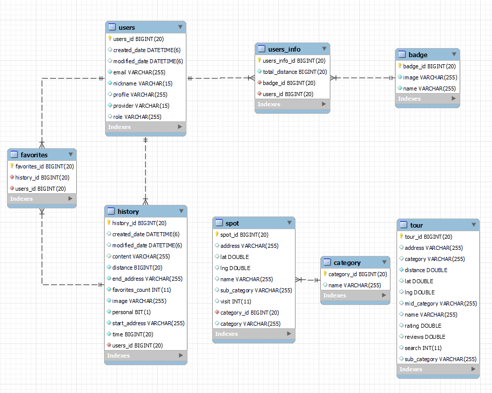

# README

# 따라와🚲

## 프로젝트 소개

### “가볍게 떠나는 따릉이 여행”

- 따릉이 기반 목적지 추천 서비스 입니다
- 자신의 주행기록을 기반으로 목적지를 추천 받을 수 있습니다
- 기존 따릉이 어플의 불편한 부분을 해소해줍니다
    - 반납 시간이 다가오면 알람을 보냅니다
    - 네비게이션을 이용하는 동시에 주변 대여소를 확인할 수 있습니다

## 프로젝트 기간

> 2023.02.27 ~ 2023.04.07
> 

## 참여 인원 및 역할 분배

<table>
<tr><td>고수연</td><td>Back-end</td><td><mark>팀장</mark>&nbsp; <mark>ERD설계</mark>&nbsp;<mark>CI/CD(자동, 무중단 배포)</mark>&nbsp;<mark>로그적재</mark></td></tr>
<tr><td>성원준</td><td>Back-end</td><td><mark>API 설계</mark>&nbsp; <mark>API 구현(여행지 추천)</mark>&nbsp;<mark>프론트 어시</mark></td></tr>
<tr><td>두소원</td><td>Back-end</td><td><mark>데이터 수집</mark>&nbsp; <mark>API 구현(회원, 주행 기록)</mark>&nbsp;<mark>UCC</mark></td></tr>
<tr><td>조혜진</td><td>Front-end</td><td></td></tr>
<tr><td>최성빈</td><td>Front-end</td><td></td></tr>
<tr><td>정예지</td><td>Front-end</td><td></td></tr>
</table>

## 개발 배경

### 기존 따릉이 앱의 문제점

1. 대여소 위치 파악만 가능
    - 대여소 까지 길 안내를 받으려면 타 지도 서비스 앱을 다운받아야 함
2. 잔여 대여시간 단순 알람
    - 반납 미이행시 과금 발생
3. 이용하는 사람만 재이용
    - 편리한 인프라가 갖춰져 있으나 새로 유입되는 유저는 적고 충성 유저가 많은 편

### 따라와만의 차별적인 서비스

1. 경로 안내 및 반납 도우미
    - 반납 시간이 다가오면 반납 알림을 주고, 주변 대여소를 선택
2. 목적지 추천
    - 자신의 위치, 주행기록을 기반으로 목적지 추천
3. 따릉이 여행 커뮤니티
    - 주행 코스를 동유하여 다른 사람들의 주행 경로를 따라 여행 가능
    - 새로운 유저 유입 증가
    

## 개발 환경

### Front-End

- React Native Expo
- TypeScript
- Recoil
- Axios
- WebView
- google map API
- 따릉이 API

### Back-End

- Intellij
- Spring Boot 3.0.4
- Java 17
- MariaDB
- Redis
- JWT
- Spring Actuator
- JPA
- Spring Security
- Flask
- Python
- Swagger

### Infra

- AWS EC2
- Jenkins
- Nginx
- Docker
- AWS S3
- ELK
- Filebeat

### 협업 Tool

- Figma
- Notion
- Jira
- GitLab

## 아키텍처

이미지 들어가야함

## ERD

## 핵심 기술

목적지 추천 알고리즘 설명 쓰기

## 기능 소개

gif로 보여줄 화면 정하고 만들어야 함

### Index

앱 소개 화면 및 소셜 로그인

- 소셜 로그인을 통해 서비스 이용 가능

목적지 추천 화면

- 추천된 장소들로 목적지를 바로 설정 가능

### Main

메인 화면

- 출발 위치에 현재 위치 표시
- 도착 위치를 직접 입력해서 주행시작 가능

카테고리별 지도 마커 표시

- 카테고리를 선택하면 주변 장소가 마커로 표시
- 아래의 목적지 설정 버튼을 통해 표시된 장소가 도착 위치로 설정됨

주행 시작화면

- 경로 확인 버튼을 눌러 출발 위치부터 도착 위치까지의 주행 경로 확인

주행 시작

따릉이 시간 선택

따릉이 종료

주행기록 저장

- 종료시 사용자의 주행 거리, 시간 저장, 달린 경로 저장
- 공개 여부를 선택하여 SNS 게시 가능

### SNS

추천순

- 자신의 위치에서 가까운 시작위치의 주행 기록과 자신의 역대 주행 기록과 가장 비슷한 순서대로 SNS 게시물 추천
- 다른 사람의 주행 기록에 “좋아요” 표시를 통해 보관 가능

### Mypage

마이페이지

- 현재까지 달린 거리를 기준으로 뱃지 부여

내 주행기록

- 나의 주행 기록 확인 및 수정, 삭제 가능

좋아요 목록

- 내가 좋아요 누른 SNS 게시글을 확인 가능

경로 따라하기

- 경로 따라하기 버튼 누르면 바로 가능한거 gif
- 경로 따라하기 버튼을 눌러 다른 사람의 시작 위치와 종료 위치를 기반으로 주행 시작 가능

### Alarm

따릉이 반납 알림

- 반납시간 까지 20분, 10분 남았을 때 앱 푸시 알림 제공
- 근처 가까운 대여소 표시

## 기대 효과

- 기존 따릉이 인프라를 활용해 보다 많은 사람이 자전거 여행을 즐길 수 있음
- 기존 앱의 불편함 개선 및 추가 기능 제공으로 따릉이를 더욱 편리하게 이용
- 맞춤형 목적지 추천으로 목적지 고민을 줄이고 새로운 목적지 발견의 즐거움을 얻을 수 있음
- 알림과 대여소 안내 기능을 통해 미반납으로 인한 과금 실수를 줄일 수 있음
